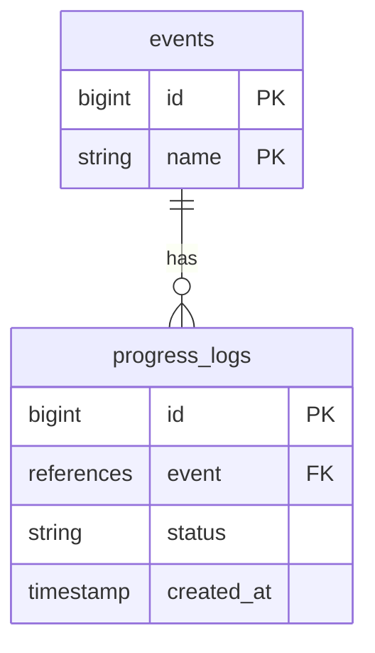

## イミュータブルなデータ設計

あるeventsのステータスを子テーブルであるprogress_logsで管理し、最新の1件が現在のステータスとして有効だとする。



## 子レコードのステータスで検索したい

この時、あるeventsのレコード(id: 1)のステータスは
```sql
SELECT * FROM progress_logs
WHERE event_id = 1
ORDER BY created_at DESC id DESC
LIMIT 1
```
のような形で取得できるが、これをeventsレコードを検索する際に行いたい。
```sql
SELECT * FROM events
INNER JOIN (
  SELECT * FROM progress_logs
  ORDER BY created_at DESC id DESC
  LIMIT 1
) progress_logs
WHERE progress_logs.status = 'done'
```
これだと ステータス done の events が複数あっても最近 done になった event 1件しかヒットしない。

### event ごとに最新の progress_log を join する

event_id ごとに最大の created_at を progress_logs 自身にjoinする。

```sql
SELECT t1.*
FROM progress_logs t1
INNER JOIN (
  SELECT event_id, MAX(created_at) AS max_created_at
  FROM progress_logs
  GROUP BY event_id
) t2
  ON t1.event_id = t2.event_id
  AND t1.created_at = t2.max_created_at
```

これで event_id ごとに最大の created_at を持つものに絞られる。ただし、created_at はユニークでないため1件とは限らない。
今度は event_id, created_at の組み合わせごとに最大の id を自身にjoinする。

```sql
SELECT t1.*
FROM progress_logs t1
INNER JOIN (
  SELECT event_id, MAX(created_at) AS max_created_at
  FROM progress_logs
  GROUP BY event_id
) t2
  ON t1.event_id = t2.event_id
  AND t1.created_at = t2.max_created_at
INNER JOIN (
  SELECT event_id, created_at, MAX(id) AS max_id
  FROM t2
  GROUP BY event_id, created_at
) t3
  ON t1.event_id = t3.event_id
  AND t1.created_at = t3.created_at
  AND t1.id = t3.max_id
```

これで event_id ごとに最新の1件のみの progress_logs ができた。あとはこれを events にjoinすればOK。

```SQL
SELECT * FROM events
INNER JOIN(
  SELECT t1.*
  FROM progress_logs t1
  INNER JOIN (
    SELECT event_id, MAX(created_at) AS max_created_at
    FROM progress_logs
    GROUP BY event_id
  ) t2
    ON t1.event_id = t2.event_id
    AND t1.created_at = t2.max_created_at
  INNER JOIN (
    SELECT event_id, created_at, MAX(id) AS max_id
    FROM t2
    GROUP BY event_id, created_at
  ) t3
    ON t1.event_id = t3.event_id
    AND t1.created_at = t3.created_at
    AND t1.id = t3.max_id       
) progress_logs ON progress_logs.event_id = events.id
```

あとは progress_logs.status で検索すれば目的を達成できる。

## 興味

created_at, event_id にindexが張られている場合、上記の方法が最もシンプルかつパフォーマンスが出るらしい(*AI調べ)。他にも`PARTITION`を使って`ROW_NUMBER() = 1`の行をjoinする方法もあるみたいだが、どっちの方が効率が良いのか気になる。

## 追記

Window関数を使った方がテーブルのスキャンが1度で済むので速いらしい。

```sql
SELECT
  *,
  ROW_NUMBER() OVER (
    PARTITION BY event_id
    ORDER BY created_at DESC, id DESC
  ) as row_num
FROM progress_logs
```
event_idごとにソートして行数を追加でSELECTしておき、これを結合する。

```sql
SELECT * FROM events
INNER JOIN(
  SELECT
    *,
    ROW_NUMBER() OVER (
      PARTITION BY event_id
      ORDER BY created_at DESC, id DESC
    ) as row_num
  FROM progress_logs
) progress_logs
  ON progress_logs.event_id = events.id
  AND progress_logs.row_num = 1
```
