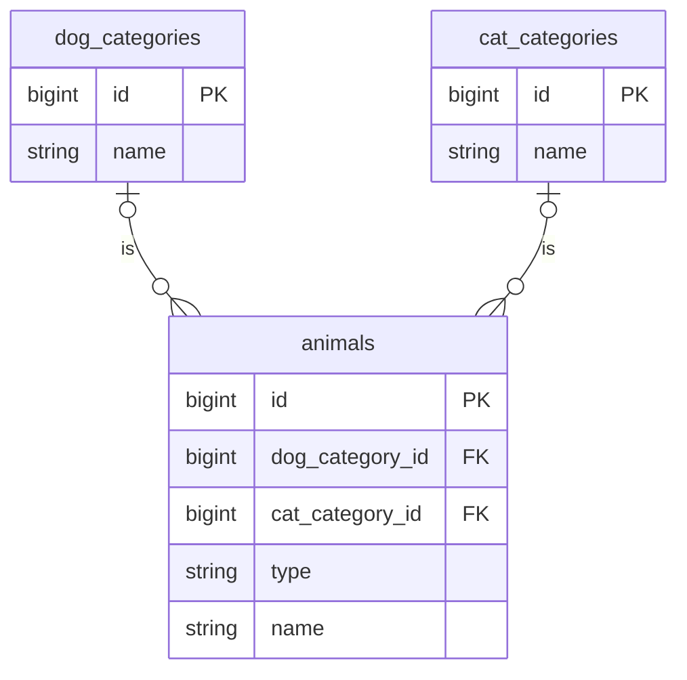
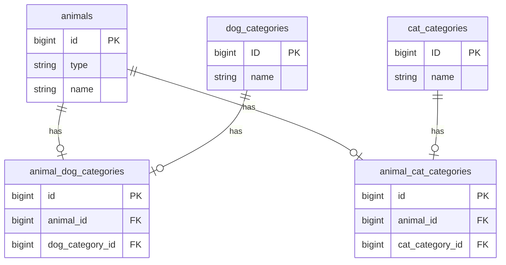

# RailsでSTI

RailsではSTI(単一テーブル継承)がサポートされている。サポートされているからには適切な場面では積極的に使っていきたい。しかしSTIは開発現場では比較的忌避されている傾向にあるように感じる。

# アンチパターンと解決策

忌避されているように感じるのは、おそらくSTIを採用した結果失敗した経験があるからだろう。自分もサービスクラスに同じような感覚を抱いている。ここではSTIでのアンチパターンであろうものと、その解決策をいくつか書いておく。

## Nullableなカラム

そもそも特定の仮装テーブルでしか使わないようなnullableなカラムが発生するのであればSTIを採用すべきではない。RailsでSTIを使うよくあるパターンとしては、紐づくテーブルがtypeによって変わるみたいなものだろうか。



```rb
class Animal < ApplicationRecord
  belongs_to :dog_category, optional: true
  belongs_to :cat_category, optional: true
end

class Dog < Animal
  class << self
    alias category dog_category
  end
end

class Cat < Animal
  class << self
    alias category cat_category
  end
end
```

これだと、`dog_category_id`と`cat_category_id`カラムはnullableになってしまう。



```rb
class Animal < ApplicationRecord
end

class Dog < Animal
  has_one: animal_dog_category
  has_one: category, through: :animal_dog_category,
                     class_name: 'DogCategory'
end

class Cat < Animal
  has_one: animal_cat_category
  has_one: category, through: :animal_cat_category,
                     class_name: 'CatCategory'
end
```

このようにCTI(クラステーブル継承)と組み合わせることで、同じように`category`で`DogCategory`や`CatCategory`にアクセスしつつ、nullableなカラムは発生しない。
